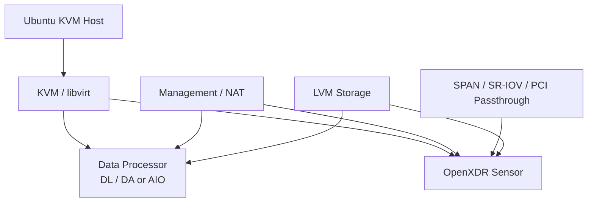

<h1 align="center">OpenXDR KVM Installer</h1>

<p align="center">
  <strong>Stellar Cyber OpenXDR Data Processor와 Sensor를 KVM에 자동 배포합니다.</strong>
</p>

<p align="center">
  Hardware 탐지부터 KVM/libvirt, network, storage, VM deployment까지 guided TUI로 구성합니다.
</p>

<p align="center">
  <a href="README.md">English</a> · <strong>한국어</strong> · <a href="https://xdr.ooo/products/openxdr-kvm-installer">제품 페이지</a>
</p>

<p align="center">
  
  
  
  
</p>

<p align="center">
  <strong>제품 페이지:</strong> <a href="https://xdr.ooo/products/openxdr-kvm-installer">xdr.ooo/products/openxdr-kvm-installer</a>
</p>

---

## OpenXDR KVM 배포를 반복 가능한 절차로 만듭니다

OpenXDR KVM Installer는 Stellar Cyber OpenXDR component를 KVM hypervisor에 배포할 때 필요한 host-side 작업을 자동화합니다.

libvirt, LVM, NIC, SR-IOV/PCI passthrough, VM resource, image, reboot/resume 상태를 개별적으로 수작업하는 대신 `whiptail` 기반의 guided workflow를 제공합니다.

## Installer 종류

| Installer | 용도 |
|---|---|
| **DP-Installer.sh** | Standalone Data Processor |
| **Sensor-Installer.sh** | Standard Modular Sensor |
| **6000-Sensor-Installer.sh** | High-performance dual-VM Sensor |
| **AIO-Sensor-Installer.sh** | AIO Data Processor + Sensor 통합 배포 |

## 자동화 영역

| 영역 | 내용 |
|---|---|
| **Hardware** | CPU, memory, disk, NIC, virtualization, IOMMU 탐지 |
| **KVM Stack** | KVM/libvirt 설치 및 구성 |
| **Networking** | Management, NAT/bridge, SR-IOV, SPAN, passthrough |
| **Storage** | LVM 기반 VM storage 준비 |
| **VM Deployment** | Image acquisition, VM definition, resource calculation |
| **Performance** | CPU affinity, NUMA-aware placement, PCI passthrough |
| **Lifecycle** | 단계별 상태 저장, reboot, resume |
| **Safety** | DRY_RUN과 configuration validation |

## Architecture



## 빠른 시작

```bash
git clone https://github.com/xdr-labs/OpenXDR-KVM-Installer.git
cd OpenXDR-KVM-Installer
sudo -i
```

배포 대상에 맞는 installer를 실행합니다.

```bash
./DP-Installer.sh
./AIO-Sensor-Installer.sh
./Sensor-Installer.sh
./6000-Sensor-Installer.sh
```

실제 변경 전에는 **DRY_RUN을 유지한 상태에서** hardware, network, storage, version, credential 설정을 확인합니다.

Installer가 reboot을 수행한 경우 같은 installer를 다시 실행하면 저장된 state를 기준으로 다음 단계부터 이어집니다.

## 주요 요구사항

- 지원되는 Ubuntu Server 버전
- Root privilege
- BIOS의 Intel VT-x / AMD-V
- SR-IOV / PCI passthrough 사용 시 Intel VT-d / AMD-Vi
- 필요한 management/SPAN NIC
- Component image/package 다운로드를 위한 network access

Installer별 정확한 OS/resource 요구사항은 영문 상세 reference를 확인합니다.

## 문서

- **제품 페이지:** https://xdr.ooo/products/openxdr-kvm-installer
- 전체 installer별 단계, network 구성, troubleshooting: [README.md](README.md)

---

<p align="center">
  <strong>Detect. Validate. Deploy. Resume safely after reboot.</strong>
</p>
