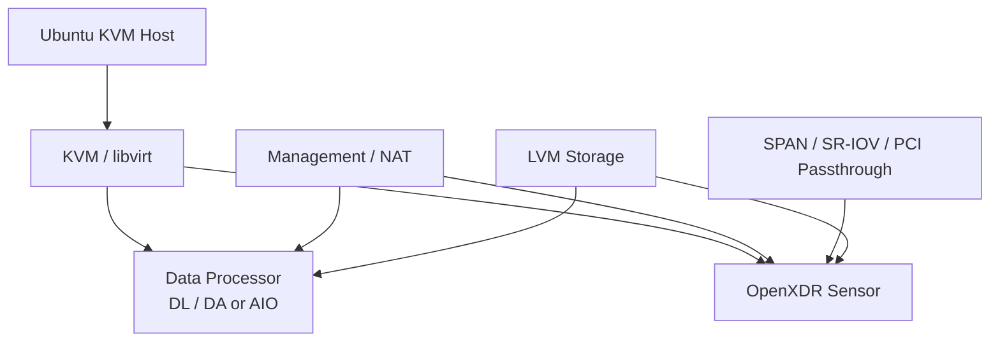

<h1 align="center">OpenXDR KVM Installer</h1>

<p align="center">
  <strong>Automated KVM deployment for Stellar Cyber OpenXDR Data Processor and Sensor components.</strong>
</p>

<p align="center">
  Detect hardware, prepare KVM/libvirt, configure networking and storage, then deploy DP, Sensor, or AIO + Sensor through a guided TUI.
</p>

<p align="center">
  <strong>English</strong> · <a href="README.ko.md">한국어</a> · <a href="https://xdr.ooo/products/openxdr-kvm-installer">Product Page</a>
</p>

<p align="center">
  
  
  
  
</p>

<p align="center">
  <strong>Product page:</strong> <a href="https://xdr.ooo/products/openxdr-kvm-installer">xdr.ooo/products/openxdr-kvm-installer</a>
</p>

---

## Build a repeatable OpenXDR KVM appliance

OpenXDR KVM Installer automates the host-side work required to deploy Stellar Cyber OpenXDR components on KVM hypervisors.

Instead of manually wiring libvirt, LVM, NICs, SR-IOV/PCI passthrough, VM resources, images, and reboot/resume state, the installers expose a guided `whiptail` workflow with explicit configuration and validation.

## Installer families

| Installer | Purpose |
|---|---|
| **DP-Installer.sh** | Standalone Data Processor deployment |
| **Sensor-Installer.sh** | Standard modular Sensor deployment |
| **6000-Sensor-Installer.sh** | High-performance dual-VM Sensor deployment |
| **AIO-Sensor-Installer.sh** | Integrated AIO Data Processor + Sensor deployment |

## What it automates

| Area | Automation |
|---|---|
| **Hardware** | CPU, memory, disk, NIC, virtualization and IOMMU discovery |
| **KVM stack** | KVM/libvirt installation and configuration |
| **Networking** | Management, NAT/bridge, SR-IOV, SPAN and passthrough workflows |
| **Storage** | LVM-based VM storage preparation |
| **VM deployment** | Image acquisition, VM definition, resource calculation and deployment |
| **Performance** | CPU affinity, NUMA-aware placement and PCI passthrough where applicable |
| **Lifecycle** | Step state, reboot handling and resume |
| **Safety** | DRY_RUN and configuration validation before destructive execution |

## Architecture



## Quick start

Clone the repository:

```bash
git clone https://github.com/xdr-labs/OpenXDR-KVM-Installer.git
cd OpenXDR-KVM-Installer
sudo -i
```

Choose the installer that matches the deployment:

```bash
# Standalone Data Processor
./DP-Installer.sh

# AIO + Sensor
./AIO-Sensor-Installer.sh

# Standard Sensor
./Sensor-Installer.sh

# High-performance Sensor
./6000-Sensor-Installer.sh
```

Review configuration and keep **DRY_RUN enabled** until hardware, networking, storage, versions, and credentials have been verified.

After an installer-triggered reboot, run the same installer again; state tracking resumes the workflow from the appropriate step.

For the product overview, use **https://xdr.ooo/products/openxdr-kvm-installer**.

---

## Scripts

### Data Processor Installer

#### `DP-Installer.sh`

Deploys OpenXDR Data Processor on KVM. This installer supports multiple Ubuntu versions and OpenXDR DP versions.

**Supported Environments:**
- **Host OS**: Ubuntu Server 16.04 LTS, 20.04 LTS, 22.04 LTS, 24.04 LTS
- **DP Versions**: v6.2 (Ubuntu 16.04 base) and v6.3+ (Ubuntu 24.04 base)

**Key Features:**
- Automated hardware detection and selection
- Network configuration with custom interface naming
- KVM/libvirt setup and configuration
- Automated VM deployment for DL (Data Lake) and DA (Data Analytics) components
- SR-IOV configuration for high-performance networking
- Hardware Enablement Kernel (HWE) installation for better hardware support
- Automatic system reboot support with resume capability

**Installation Steps:**
1. Hardware / NIC / Disk Detection and Selection
2. HWE Kernel Installation
3. NIC Renaming / ifupdown Switch and Network Configuration
4. KVM / Libvirt Installation and Basic Configuration
5. Kernel Parameters / KSM / Swap Tuning
6. SR-IOV Drivers (iavf/i40evf) + NTPsec Configuration
7. LVM Storage Configuration (DL/DA root + data)
8. libvirt Hooks and OOM Recovery Scripts
9. DP Image and Deployment Scripts Download
10. DL-master VM Deployment
11. DA-master VM Deployment
12. SR-IOV / CPU Affinity / PCI Passthrough
13. Install DP Appliance CLI package

**Network Configuration:**
- **KVM Management Interface**: Automatically configured with IP address `192.168.0.100` for local KVM management
- **DL/DA Communication & Management**: Interfaces connected via NAT for communication and management
- **Cluster Interface**: Connected using SR-IOV-based Virtual Functions (VF) for high-performance cluster networking

**System Requirements:**
- **Operating System**: Ubuntu Server 16.04 / 20.04 / 22.04 / 24.04 LTS
- **Root Access**: Script must be run with root privileges
- **Hardware Virtualization**: Intel VT-x / AMD-V enabled in BIOS
- **IOMMU**: Intel VT-d / AMD-Vi enabled for SR-IOV support

### Sensor Installers

#### `AIO-Sensor-Installer.sh`

Deploys OpenXDR AIO (All-In-One) Data Processor and Sensor components together on KVM in a single integrated installation process. This installer provides a unified deployment solution for environments requiring both Data Processor and Sensor components on the same host.

**Key Features:**
- **Integrated Deployment**: Deploys both AIO (Data Processor) and Sensor VMs in a single installation process
- **13-Step Installation Process**: Comprehensive step-by-step installation with state tracking
- **Automatic Resource Calculation**: Automatically calculates VM resources (vCPU, memory) based on available system resources
- **LVM Storage Management**: Automated LVM storage configuration for both AIO and Sensor VMs
- **Hardware Enablement Kernel (HWE)**: Installs HWE kernel for better hardware support on Ubuntu systems
- **Network Mode**: NAT mode support for management and communication
- **SPAN Interface Support**: Multiple SPAN interfaces can be attached using PCI passthrough or bridge mode

**Installation Steps:**
1. Hardware / NIC / CPU / Memory / SPAN NIC Selection
2. HWE Kernel Installation
3. NIC Name/ifupdown Switch and Network Configuration
4. KVM / Libvirt Installation and Basic Configuration
5. Kernel Parameters / KSM / Swap Tuning
6. libvirt Hooks Installation
7. LVM Storage Configuration (AIO)
8. DP Download (AIO)
9. AIO VM Deployment
10. Sensor LV Creation + Image/Script Download
11. Sensor VM Deployment
12. PCI Passthrough / CPU Affinity
13. Install DP Appliance CLI package

**Network Configuration:**
- **Management Interface**: NAT mode for host and VM management
- **AIO Communication**: NAT-based network for AIO VM communication
- **Sensor Communication**: NAT-based network for Sensor VM communication
- **SPAN Interfaces**: Can be attached to Sensor VM using either:
  - PCI passthrough (recommended for best performance, requires IOMMU)
  - Bridge mode (alternative virtualized networking option)

**System Requirements:**
- **Operating System**: Ubuntu Server 20.04 / 22.04 / 24.04 LTS
- **CPU**: 12 vCPU or more (automatically calculated)
- **Memory**: 16GB or more (automatically calculated)
- **Disk**: Minimum 100GB free space (80GB minimum) in ubuntu-vg volume group
- **BIOS Settings**: Intel VT-d / AMD-Vi (IOMMU) enabled for PCI passthrough

**Special Notes:**
- System automatically reboots after STEP 03 (network configuration) and STEP 05 (kernel tuning)
- After reboot, simply run the installer again to automatically continue from the next step
- Netplan is disabled and replaced with ifupdown during installation (STEP 03)
- DRY_RUN mode (default: enabled) allows testing without making actual changes

#### `6000-Sensor-Installer.sh`

Deploys OpenXDR modular sensors on KVM, optimized for high-performance deployments similar to Stellar Cyber m6000 appliances.

**Key Features:**
- **Dual NUMA Node Architecture**: Deploys 2 sensor VMs across 2 NUMA nodes
- **High Performance**: Each VM supports 20 Gbps, providing up to **40 Gbps total sensor capacity**
- Flexible network configuration options
- Automatic resource calculation based on available system resources

**Network Configuration:**
- **Management Interface**: Configurable as NAT or bridge mode
- **SPAN Interfaces**: Multiple SPAN interfaces can be selected and attached to sensors using either:
  - PCI passthrough (for direct hardware access, requires IOMMU)
  - Bridge mode (for virtualized networking)

**System Requirements:**
- **Operating System**: Ubuntu Server 20.04 / 22.04 / 24.04 LTS
- **CPU**: Multiple cores with NUMA support (automatically calculated)
- **Memory**: Sufficient memory for dual sensor VMs (automatically calculated)
- **BIOS Settings**: Intel VT-d / AMD-Vi (IOMMU) enabled for PCI passthrough

#### `Sensor-Installer.sh`

Deploys OpenXDR modular sensors on KVM with flexible configuration options.

**Key Features:**
- Standard modular sensor deployment
- Flexible network configuration
- Support for multiple SPAN interfaces
- Automatic resource calculation based on available system resources

**Network Configuration:**
- **Management Interface**: Configurable as NAT or bridge mode
- **SPAN Interfaces**: Multiple SPAN interfaces can be selected and attached to sensors using either:
  - PCI passthrough (for direct hardware access, requires IOMMU)
  - Bridge mode (for virtualized networking)

**System Requirements:**
- **Operating System**: Ubuntu Server 20.04 / 22.04 / 24.04 LTS
- **CPU**: 12 vCPU or more (automatically calculated)
- **Memory**: 16GB or more (automatically calculated)
- **Disk**: Minimum 100GB free space in ubuntu-vg volume group
- **BIOS Settings**: Intel VT-d / AMD-Vi (IOMMU) enabled for PCI passthrough

## Prerequisites

### System Requirements

- **Operating System**: Ubuntu Server 16.04 / 20.04 / 22.04 / 24.04 LTS (version depends on the installer)
- **Root Access**: Scripts must be run with root privileges (`sudo -i` or `sudo su -`)
- **Hardware Virtualization**: Intel VT-x / AMD-V enabled in BIOS
- **IOMMU Support**: Intel VT-d / AMD-Vi enabled in BIOS (required for SR-IOV and PCI passthrough)
- **Required Tools**: 
  - `whiptail` (for TUI interface) - will be checked and prompted if missing
  - KVM/libvirt support - will be installed automatically during installation

### Network Requirements

- **Management Network**: At least one network interface for host management
- **SPAN Interfaces**: Additional network interfaces for traffic mirroring (Sensor installers)
- **Internet Access**: Required for downloading DP/Sensor images and packages

## Installation

### Quick Start

1. **Clone or download this repository:**
   ```bash
   git clone <repository-url>
   cd "OpenXDR KVM Installer"
   ```

2. **Switch to root user:**
   ```bash
   sudo -i
   ```

3. **Create the installation directory:**
   ```bash
   mkdir -p /root/xdr-installer
   ```

4. **Copy the appropriate installer script:**
   ```bash
   # For Data Processor
   cp DP-Installer.sh /root/xdr-installer/
   
   # For AIO + Sensor
   cp AIO-Sensor-Installer.sh /root/xdr-installer/
   
   # For Sensor only
   cp Sensor-Installer.sh /root/xdr-installer/
   
   # For High-Performance Sensor (m6000-style)
   cp 6000-Sensor-Installer.sh /root/xdr-installer/
   ```

5. **Make the script executable:**
   ```bash
   cd /root/xdr-installer
   chmod +x <installer-script>.sh
   ```

6. **Run the installer:**
   ```bash
   ./<installer-script>.sh
   ```

### Installation Process

All installers follow a similar workflow:

1. **Initial Configuration**: Set DRY_RUN mode, component versions, and ACPS credentials
2. **Automatic Installation**: Select "Auto Execute All Steps" to run all steps sequentially
3. **Manual Step Execution**: Alternatively, execute specific steps individually as needed
4. **Automatic Resume**: After system reboots, simply run the installer again to continue from the next step

## Usage

All installers provide an interactive menu-driven interface using `whiptail`:

### Main Menu Options

1. **Auto Execute All Steps**: Automatically executes all installation steps sequentially
   - Recommended for fresh installations
   - Automatically handles reboots and resumes from the next step

2. **Execute Specific Step**: Run individual steps as needed
   - Useful for troubleshooting or re-running failed steps
   - State is tracked, so you can resume from any point

3. **Configuration**: Configure settings such as:
   - **DRY_RUN mode**: Simulation mode (default: enabled) - set to `0` for actual installation
   - **Component versions**: DP version, Sensor version
   - **ACPS authentication**: Credentials for downloading components
   - **Network settings**: Interface configurations, IP addresses
   - **Resource allocation**: VM resources (auto-calculated by default)

4. **Full Configuration Validation**: Verify all configuration matches installation requirements
   - Checks hardware compatibility
   - Validates network configuration
   - Verifies system prerequisites

5. **Script Usage Guide**: View detailed usage instructions and examples

### Command Examples

```bash
# Start fresh installation
./AIO-Sensor-Installer.sh
# Select menu option 3 to configure DRY_RUN=0, DP_VERSION, ACPS credentials
# Select menu option 1 to start automatic installation

# Resume after reboot
./AIO-Sensor-Installer.sh
# Select menu option 1 - automatically continues from next step

# Re-run specific step
./AIO-Sensor-Installer.sh
# Select menu option 2, then choose the step to re-run
```

## Features

### Core Features

- **Interactive TUI**: User-friendly text-based interface using `whiptail`
- **Step-by-Step Execution**: Modular step execution with state tracking
- **DRY_RUN Mode**: Test installations without making actual changes (default: enabled)
- **State Management**: Tracks installation progress and allows resuming from any step
- **Comprehensive Logging**: Detailed logs stored in `${BASE_DIR}/state/xdr_install.log`
- **Automatic Resume**: After system reboots, simply run the installer again to continue

### Automation Features

- **Hardware Detection**: Automatic detection and selection of network interfaces and storage devices
- **Network Configuration**: Automated network setup with:
  - Custom interface naming
  - SR-IOV support (DP installers)
  - NAT mode (Sensor/AIO installers)
  - Automatic ifupdown configuration (replaces netplan)
- **VM Deployment**: Automated deployment of Data Processor and Sensor VMs
- **Automatic Resource Calculation**: VM resources (vCPU, memory) are automatically calculated based on available system resources
- **LVM Storage Management**: Automated LVM storage configuration for VM deployment
- **Hardware Enablement Kernel (HWE)**: Automatic HWE kernel installation for better hardware support
- **Auto-Reboot Support**: Automatic system reboots when necessary (e.g., after kernel installation or network configuration) with automatic resume

### Advanced Features

- **SR-IOV Configuration**: High-performance networking using Virtual Functions (DP installers)
- **PCI Passthrough**: Direct hardware access for SPAN interfaces (requires IOMMU)
- **CPU Affinity**: NUMA-aware CPU pinning for optimal performance
- **libvirt Hooks**: Automatic VM management and OOM recovery
- **NTP Configuration**: Automatic NTPsec setup for time synchronization

## Important Notes

### General Notes

- **Automatic Reboots**: The installers automatically handle reboots when necessary (e.g., after kernel installation or network configuration)
- **Resume After Reboot**: After a reboot, simply run the installer again and it will automatically continue from the next step
- **Configuration Persistence**: All configuration is saved in `${BASE_DIR}/state/xdr_install.conf` and can be reviewed or modified through the configuration menu
- **State Tracking**: Installation progress is tracked in `${BASE_DIR}/state/xdr_install.state`
- **Logging**: Detailed logs are available in `${BASE_DIR}/state/xdr_install.log`

### DRY_RUN Mode

- **Default Behavior**: DRY_RUN mode is enabled by default for safety
- **Actual Installation**: Set `DRY_RUN=0` in the configuration menu (option 3) before running actual installation
- **Testing**: Use DRY_RUN mode to test the installation process without making changes

### Network Configuration

- **Netplan Replacement**: Netplan is automatically disabled and replaced with ifupdown during network configuration (STEP 03)
- **Interface Naming**: Network interfaces are renamed to custom names (e.g., `mgmt`, `cluster`, `span`)
- **Automatic Reboot**: System automatically reboots after STEP 03 (network configuration) to apply changes

### Hardware Requirements

- **IOMMU**: PCI passthrough for SPAN interfaces requires IOMMU (Intel VT-d / AMD-Vi) to be enabled in BIOS
- **Virtualization**: Hardware virtualization (Intel VT-x / AMD-V) must be enabled in BIOS
- **Resource Calculation**: VM resources are automatically calculated based on available system resources - no manual configuration needed

### Installation Tips

- **Fresh Installation**: For new installations, use "Auto Execute All Steps" (menu option 1)
- **Troubleshooting**: If a step fails, use "Execute Specific Step" (menu option 2) to re-run the failed step
- **Validation**: Use "Full Configuration Validation" (menu option 4) before starting installation to verify prerequisites
- **Configuration Review**: Always review configuration (menu option 3) before starting actual installation

## File Structure

```
OpenXDR KVM Installer/
├── DP-Installer.sh              # Data Processor installer
├── AIO-Sensor-Installer.sh      # AIO + Sensor integrated installer
├── Sensor-Installer.sh          # Standard Sensor installer
├── 6000-Sensor-Installer.sh     # High-performance Sensor installer (m6000-style)
└── README.md                    # This file
```

## Troubleshooting

### Common Issues

1. **whiptail not found**
   ```bash
   sudo apt update && sudo apt install -y whiptail
   ```

2. **Installation stops after reboot**
   - Simply run the installer script again - it will automatically resume from the next step

3. **DRY_RUN mode not making changes**
   - Set `DRY_RUN=0` in the configuration menu (option 3)

4. **PCI passthrough not working**
   - Verify IOMMU is enabled in BIOS (Intel VT-d / AMD-Vi)
   - Check IOMMU is enabled in kernel: `dmesg | grep -i iommu`
   - Verify IOMMU groups: `find /sys/kernel/iommu_groups/ -type l`

5. **Network configuration issues**
   - Check interface naming: `ip link show`
   - Verify ifupdown configuration: `cat /etc/network/interfaces`
   - Check network status: `systemctl status networking`

### Log Files

- **Installation Log**: `${BASE_DIR}/state/xdr_install.log`
- **State File**: `${BASE_DIR}/state/xdr_install.state`
- **Configuration File**: `${BASE_DIR}/state/xdr_install.conf`

### Getting Help

- Review the installation logs for detailed error messages
- Use the "Script Usage Guide" option in the installer menu
- Check the configuration validation output for prerequisite issues

## Support

For issues, questions, or contributions, please refer to:
- Repository's issue tracker
- Stellar Cyber support channels
- Installation logs for detailed error information

## Related Projects

- [Stellar Appliance CLI](../Stellar%20appliance%20cli/): Command-line interface for managing Stellar Cyber appliances

## License

Please refer to the license file in this repository for licensing information.

